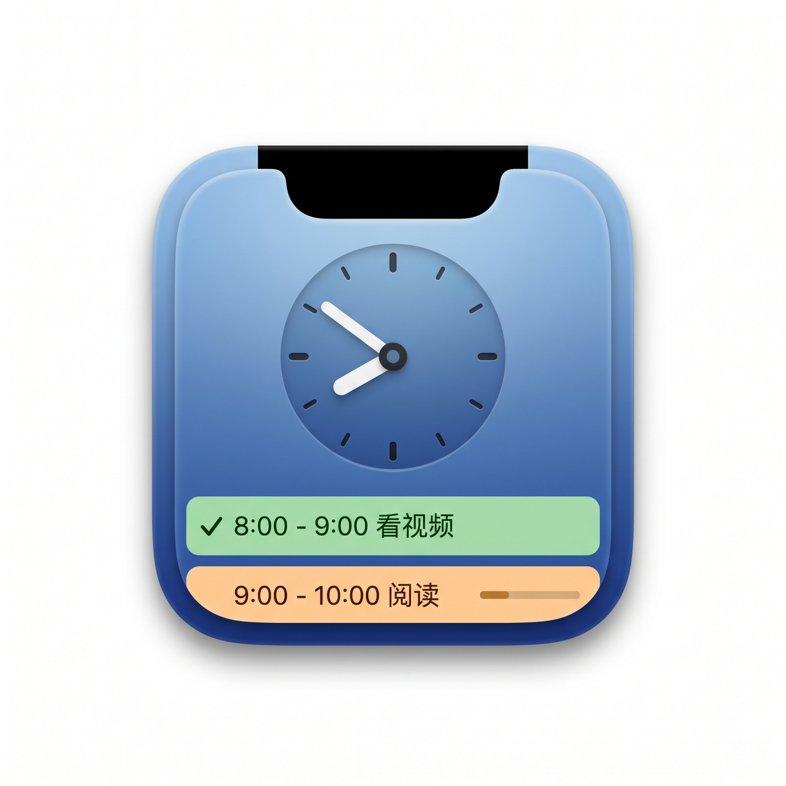

# NotchBlock

<p align="center">
  
</p>

<p align="center">
  <strong>Macのハードウェアノッチをタイムブロッキングの入り口に変える。</strong>
</p>

<p align="center">
  <a href="https://github.com/lorenzozanee/NotchBlock/releases"></a>
  <a href="LICENSE"></a>
  <a href="#"></a>
  <a href="#"></a>
</p>

<p align="center">
  <sub><a href="README.md">English</a> | <a href="README_ZH.md">中文</a> | <a href="README_FR.md">Français</a> | <a href="README_ES.md">Español</a> | 日本語 | <a href="README_KO.md">한국어</a></sub>
</p>

---

NotchBlockは、macOS向けのミニマルで**強制的な**タイムブロッキングスケジューラーです。ハードウェアノッチを見えないインタラクションポイントに変え、タスク終了時に見逃せないフルスクリーンオーバーレイで中断し、強制的に集中力を維持します。

> 🎯 ノッチにカーソルを合わせる → 今日のスケジュールを表示 → タスク終了時にフルスクリーン通知 → 完了確認が必須

## ✨ 機能

| 機能 | 説明 |
|---|---|
| 🔲 **ノッチホバーパネル** | ノッチに0.5秒カーソルを合わせると、スケジュールがエレガントにスライド表示 |
| 🛡️ **フルスクリーン認識** | 動画、ゲーム、プレゼンテーション中はノッチ検出を自動一時停止 |
| ⚡ **強制中断オーバーレイ** | タスク終了時に全画面が暗転し、他の操作をすべてブロック |
| ⏱️ **5分のタイムアウト** | 未確認のブロックは自動的に「未完了」とマークされ、システム通知が送信 |
| 📋 **日次スケジューラー** | 時間の競合を自動検出するミニマルなタイムラインリスト |
| 🔄 **履歴修正** | タスクのステータスを手動で調整し、正確な振り返りが可能 |
| 🚀 **ログイン時起動** | メニューバーからワンクリックで切り替え、バックグラウンドで静かに常駐 |
| 💾 **ローカルストレージ** | すべてのデータをローカルに保存 — ネットワーク不要、完全にプライベート |

## 📥 インストール

[Releases](https://github.com/lorenzozanee/NotchBlock/releases) ページから最新の `NotchBlock-*.dmg` をダウンロードしてください。

### 3ステップのセットアップ

DMGを開いたら、ウィンドウの指示に従ってください：

1. **アプリケーションフォルダにドラッグ** — `NotchBlock.app` を `アプリケーション` フォルダにドロップ
2. **`FixQuarantine.command` をダブルクリック** — 検疫属性を削除してアプリを起動（初回起動時は右クリック → 開くが必要）
3. **完了** — メニューバーアイコンが表示され、使用開始できます

> 💡 なぜステップ2が必要？NotchBlockはAppleの公証を受けていません（年間99ドルの開発者アカウントが必要）。macOSはダウンロードしたアプリに検疫属性を付けます。`FixQuarantine.command` が `xattr -cr /Applications/NotchBlock.app` を実行してこのフラグを解除します。

初回起動後に以下の権限を許可してください：

| 権限 | 用途 | 設定パス |
|---|---|---|
| **アクセシビリティ** | フルスクリーンアプリの検出 | システム設定 → プライバシーとセキュリティ → アクセシビリティ |
| **通知** | タスクタイムアウトのアラート | システム設定 → 通知 → NotchBlock |

### 手動インストール

```bash
# DMG内のスクリプトが実行できない場合は手動で：
xattr -cr /Applications/NotchBlock.app
open /Applications/NotchBlock.app
```

## 🏗️ アーキテクチャ

```
macOS 14.0+ · Swift 6.1 · SwiftUI + AppKit
```

**主要API：**

- `NSTrackingArea` — ノッチ領域のマウストラッキング
- `NSPanel` + `.nonactivatingPanel` — ドロップダウンパネル（フォーカスを奪わない）
- `CGShieldingWindowLevel()` + `.fullScreenAuxiliary` — すべてを貫通するオーバーレイ
- `CGWindowList` — フルスクリーン状態の検出
- `SMAppService` — ログイン項目の登録
- `UserNotifications` — タイムアウトバナー通知
- `UserDefaults` / ISO 8601 JSON — ローカル永続化

**プロジェクト構造：**

```
NotchBlock/
├── Models/           TimeBlock · BlockStatus
├── Managers/         TimeBlockStore · NotchTracker · NotchPanelController
│                     OverlayWindowController · BlockScheduler
├── Views/            MainSchedulerView · TimeBlockRowView · AddEditBlockView
│                     NotchPanelView · OverlayView
└── Utilities/        DateExtensions · LaunchManager
```

## ⌨️ ショートカット

| ショートカット | 操作 |
|---|---|
| `⌘O` | スケジューラーパネルを開く |
| `⌘Q` | NotchBlockを終了 |

## 📝 開発

```bash
# .swiftファイルの追加・削除後にXcodeプロジェクトを再生成
python3 generate_xcode_project.py

# CLIビルド
xcodebuild -project NotchBlock.xcodeproj -scheme NotchBlock -configuration Release build

# DMGを作成
./scripts/build-dmg.sh
```

## 📄 ライセンス

[MIT License](LICENSE)

---

<p align="center">
  <sub>集中作業のために❤️を込めて作られました · macOS Apple Silicon</sub>
</p>
